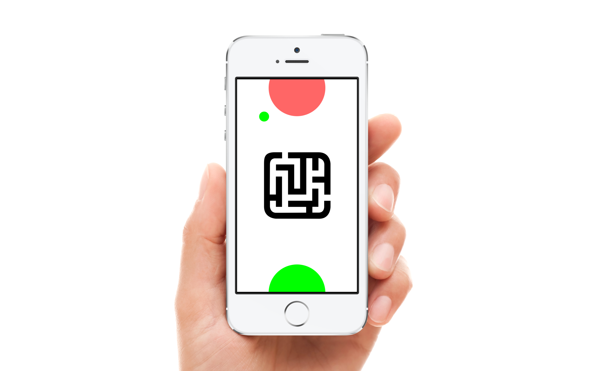
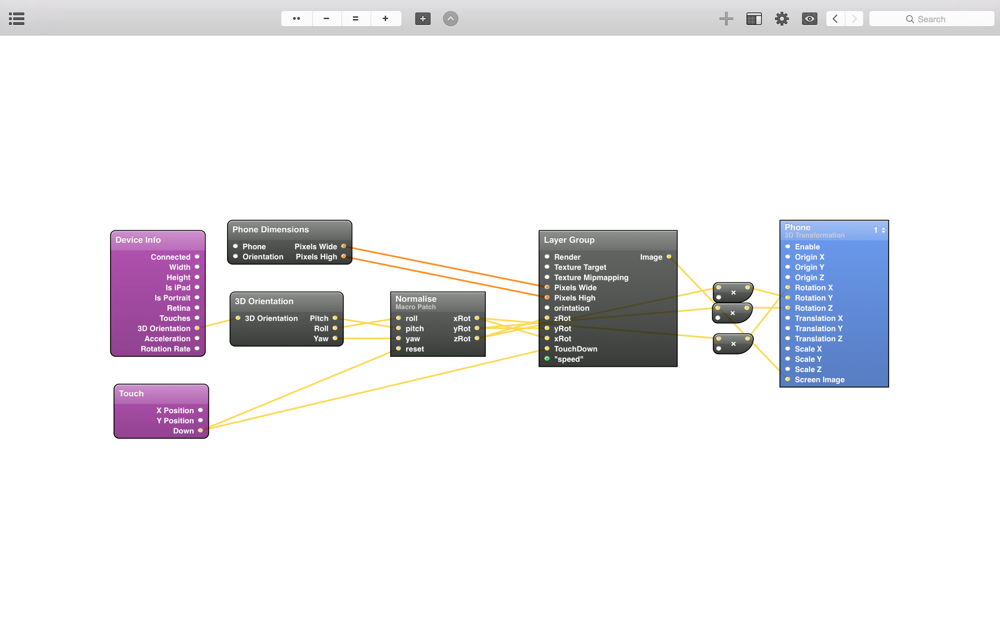

# Origami-Maze
Example of collisions and 3D device orientation
===========

Collision detection example with 3D orientation controls for the prototyping tool Origami (by Facebook)

This is a testcase for an impact UI i'm working on.

Please email me and let me know how you used it. 

https://vimeo.com/124323243

## Features
- Collision detection
- 3D orientation
- Responsive

## How to Use
- Clone this repo
- Open the **.qc files**
- Have fun!

## Dependencies
Requires [Quartz Composer](http://adcdownload.apple.com/Developer_Tools/graphics_tools_for_xcode__xcode_6.1/graphicstools_for_xcode_6.1.dmg "Quartz Composer") and [Origami](http://facebook.github.io/origami/download/ "Origami") 

## Known Issues

